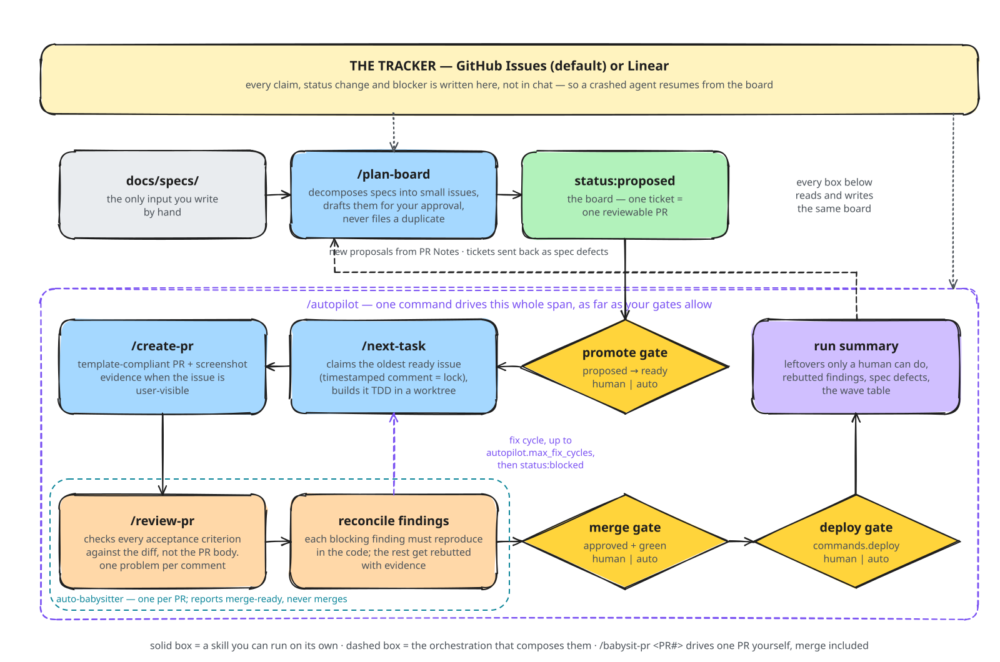

# raw

An installable agentic workflow for Claude Code and Codex, driven by your issue tracker. An AI planner proposes tasks as issues, AI builders pull them and deliver PRs, an independent AI reviewer checks the diffs, and you decide which gates stay human. GitHub Issues is the default; set `tracker.provider: linear` and the same skills run on Linear workflow states and `blockedBy` relations. Either way the tracker is the machine source of truth, so every state transition is auditable and any crashed agent can pick up where things left off.

Workflow content is plain files copied into your repo: skills, agent definitions, issue/PR templates, workflow docs, one config file. The only compatibility indirection is `.agents/skills`, which links Codex to the canonical Claude skill tree. Small, hackable, no framework. `raw update` skips every file you've edited, so your version is the one that runs.

The other moving parts swap one config key at a time: worktree provider, executor and reviewer runners (Claude or Codex, per role), the TDD and verification skills, the screenshot driver, an optional second reviewer from another model family. See [Pluggability](#pluggability) for the full table. PRs stay on GitHub under every tracker.

<p align="center">
  <picture>
    <source media="(prefers-color-scheme: dark)" srcset="docs/assets/raw-workflow-dark.svg">
    
  </picture>
</p>

The diagram emphasizes context boundaries: solid boxes are normal stages; dashed reconciliation is conditional. Dispatchers hold board context, builders hold one issue, and the independent reviewer remains separate. Source: [`docs/assets/raw-workflow.excalidraw`](docs/assets/raw-workflow.excalidraw).

## Quickstart (2-minute setup)

1. Install into your repo (copies files; skips anything that already exists):

```bash
npx github:rodrigoeduardo/raw init
```

2. In Claude Code run `/configure`; in Codex invoke `$configure`. RAW installs canonical skills
   under `.claude/skills` and exposes them to Codex through `.agents/skills` without copying them.

3. Write your specs in `docs/specs/` (skeletons with guidance are installed), then run `/plan-board`. Approve the drafted batch and it files the issues.

4. Promote an issue to `status:ready`, then either:
   - `/next-task` — build one task, get a PR, review and merge yourself, or
   - `/autopilot` — drain the whole board: build → review → merge → deploy, as far as your gates allow.

   `/babysit-pr <PR#>` takes any single PR the rest of the way (CI triage → review findings → merge-ready) without running the board.

Prerequisites: [`gh` CLI](https://cli.github.com/) authenticated, and the [superpowers](https://github.com/obra/superpowers) skills (or rebind `bindings:` in `raw.config.yml` to your own TDD/verification skills).

You can also install just the skills with [skills.sh](https://skills.sh) (`npx skills add rodrigoeduardo/raw`), but templates, the GitHub Action, and the workflow docs still need `raw init`.

## Why this workflow exists

### #1: Agents build the wrong thing

**The problem.** Point an agent at a vague goal and it invents scope. The expensive part is the day of plausible code for a task nobody wanted.

**The fix.** `/plan-board` decomposes your specs into small issues with objectively checkable acceptance criteria, drafts them for your approval first, and never files a duplicate. Builders are then hard-scoped to the issue's Requirements checklist; follow-up ideas go to the PR's Notes section, which the planner turns into future proposals.

The issue is the builder's prompt, so the planner follows explicit decomposition rules: no test-only tickets, migration and its usage in one ticket, no "foundation" tickets of functions nobody calls, one ticket = one reviewable PR (≲400 lines), dependencies only where a ticket states `Depends on #N`. Risky features are born with an OFF-by-default flag so every PR can merge without changing behavior. The template asks for expected behavior, test scenarios, technical pointers and rollout/observability, the things a builder otherwise guesses at.

When a ticket fails twice, raw treats it as a spec defect instead of blaming the model. Relaunching is forbidden; the issue goes back to `proposed` with a `needs rewrite:` comment for the planner.

### #2: Agent sessions don't know when to stop

**The problem.** One long session tries to do planning, three tasks, and a refactor it noticed along the way. Context degrades, discipline degrades with it.

**The fix.** Work selection and execution are separate. `/next-task` selects and claims one issue,
then `/build-issue` performs the only implementation path: targeted context, TDD, verification,
bounded evidence, PR, stop. Autopilot claims before dispatching `auto-executor`, which invokes
`/build-issue` directly instead of scanning the board again. One issue ends one executor invocation.

### #3: Nobody reads the AI's PRs

**The problem.** Agent PRs pile up. Rubber-stamping them defeats the point of review; reading every line doesn't scale.

**The fix.** `/review-pr` plus label semantics you control. The reviewer verifies each acceptance criterion against the actual diff rather than the PR body's claims, and posts one problem per comment. By default its verdict is advisory (you still read and merge). Apply `ai-review:final` and an approved verdict can stand in for your read. Either way the review never merges anything.

Two things keep the review loop honest:

- **Findings are reconciled before they become work.** The default babysitter is cheap because
  CI/status/fingerprint checks are mechanical. If substantive blocking findings exist, it batches
  them into one bounded strong-model reconciler call. No findings means no reconciler; confirmed
  findings alone reach a targeted fix.
- **Evidence beats assertion on user-visible work.** A green test proves the logic ran, not that anything rendered. When an issue is marked user-visible, the builder screenshots the real running app driving the real flow, and the reviewer looks at it before the verdict. The gate is "someone besides the worker looked", not "a screenshot exists". Headless repos never notice it.

`/babysit-pr` is that whole per-PR procedure — CI triage (a cancelled run is not a failure), a feedback fingerprint so a comment arriving after green CI still blocks merge, reconciliation, fix, merge-ready. Run it yourself on a single PR when you don't want the whole board; `/autopilot` runs the same thing, one babysitter per PR, and keeps only the merge.

### #4: Autonomy is a dial

**The problem.** Most autonomous-agent setups are all-or-nothing: either you babysit every step or you hand over the keys.

**The fix.** `/autopilot` plus the gate config. Three gates (promote, merge, deploy), each set to `human` or `auto` in `raw.config.yml`, all defaulting to `human`. Autopilot claims issues, dispatches a builder for each and a babysitter to take its PR to merge-ready, and goes exactly as far as your gates allow: with `merge: human` it parks approved+green PRs for your click; with everything `auto` it drains the board and deploys. `auto:hold` labels and an `AUTO-STOP` issue give you brakes at any granularity.

It builds the dependency DAG from `Depends on #N` lines and prints a wave table (`| Wave | Issues | Unblocks |`) so you can see the critical path. But it *schedules* off the claimable frontier, re-derived from GitHub every pass. Batched waves are a snapshot, and a snapshot is wrong the moment you edit the board mid-run or a session crashes.

### #5: Handing off is where the context dies

**The problem.** Autonomous runs end and leave you nothing but merged PRs. The follow-ups that only a human can do (backfills, flag flips, secrets, docs sync) are buried in PR bodies nobody re-opens.

**The fix.** Run summaries surface the leftovers instead of acting on them. Every merged PR's "Human actions needed" section is harvested into the summary, alongside findings that were rebutted, threads escalated for your decision, issues sent back as spec defects, and the final wave table.

### #6: Workflow config scattered across prompts

**The problem.** The commands to run, the labels to use, which TDD skill to invoke: usually smeared across CLAUDE.md prose where agents half-remember them.

**The fix.** One file, `raw.config.yml`, read by every skill and written by the `/configure` interview. Swap `superpowers:test-driven-development` for your own TDD skill by editing one line, because skills invoke *roles* (`bindings.tdd`) rather than hardcoded names.

## Pluggability

Defaults are GitHub Issues + Claude Code worktrees + Claude runners, and if that's your stack you can stop reading. The default path is inline in the skills and costs nothing. Everything else is a config key plus one adapter doc under `docs/workflow/adapters/`; the skills' decision logic never changes with the provider, only the spelling of the operations.

| Axis | Config | Options |
|---|---|---|
| Tracker | `tracker.provider` | `github` (default) · `linear` (native `blockedBy` relations, workflow-state mapping, via the Linear MCP server) |
| Worktrees | `worktrees.provider` | `claude` (default; native Claude or explicit Codex worktrees) · `orca` (visible terminal-driven workers) · `conductor` (experimental guidance) |
| Runners | `runners.executor` / `.reviewer` | `claude` (model + effort) · `codex` (project skills + narrow stdin prompt to headless `codex exec`) |
| PR lifecycle | `runners.babysitter` / `.reconciler` | cheap mechanical babysitter · conditional strong reconciler |
| Second opinion | `runners.adversarial_reviewer` | off by default; a reviewer from another model family, comments only. raw's reviewer keeps the verdict |
| Evidence | `evidence.ui_screenshot` · `evidence.driver` | gate: `auto` (default) · `required` · `off`. capture: bounded Playwright CLI (default) · `manual` |

**PRs are always GitHub**, so `ai-review:*` labels and the review policy are identical under every tracker.

## What gets installed

```
your-repo/
├── raw.config.yml                    # gates, commands, labels, bindings
├── CLAUDE.md                         # raw section appended (markers, idempotent)
├── .agents/skills -> ../.claude/skills # Codex compatibility; canonical content is not copied
├── .claude/
│   ├── skills/                      # includes next-task dispatcher + single-issue build-issue
│   ├── agents/                      # executor, cheap babysitter, reconciler, independent reviewer
│   └── settings.json                # worktree symlink config (Node default; edit for your stack)
├── .github/
│   ├── ISSUE_TEMPLATE/task.md       # board task template
│   ├── pull_request_template.md
│   └── workflows/
│       ├── pr-merged-cleanup.yml   # strips status:in-review on merge
│       └── raw-update-check.yml    # weekly: opens an issue if a newer raw is out
├── .raw-manifest.json                # per-file hash + version — powers `raw update`
└── docs/
    ├── specs/                       # skeleton spec templates (planner input)
    └── workflow/                    # board-protocol, git-conventions, review-policy, pr-babysit
        └── adapters/                # one doc per tracker / worktree / runner provider
```

## Config reference (`raw.config.yml`)

| Key | Default | Meaning |
|---|---|---|
| `gates.promote` | `human` | Who moves `status:proposed → status:ready` |
| `gates.merge` | `human` | Who merges approved+green PRs (`auto` = autopilot merges) |
| `gates.deploy` | `human` | Who triggers `commands.deploy` after a merge batch |
| `commands.install/lint/test/test_all` | unset | Your stack's commands; unset = step skipped, never guessed |
| `commands.deploy` | unset | Deploy command; unset = assume CD on the default branch |
| `commands.dev` | unset | Run the app locally — required by the evidence gate (needs env? see `.worktreeinclude`) |
| `git.integration_branch` | unset | Branch workers cut from, PRs target, merge gate measures "behind" against; unset = repo's git default branch |
| `labels.areas` | `[]` | Domain `area:*` labels for issues |
| `specs_dir` | `docs/specs` | Planner input tree |
| `bindings.tdd` / `bindings.verification` | superpowers skills | Which skill fulfills each role — swappable |
| `autopilot.parallel` | `1` | Concurrent executors (each in its own worktree) |
| `autopilot.max_fix_cycles` | `1` | Automated review→fix rounds before unresolved work surfaces |
| `tracker.provider` | `github` | Where the board lives (`github` \| `linear`) |
| `tracker.linear.team` / `.states` | unset | Linear team key and raw-status → workflow-state map |
| `tracker.linear.close_on_merge` | `integration` | Who moves the Linear issue to Done on merge (`integration` = native Linear↔GitHub sync; `manual` = orchestrator transitions it itself) |
| `worktrees.provider` | `claude` | Isolated workspace provider (`claude` \| `orca` \| `conductor`) |
| `worktrees.seed_files` | `[]` | Gitignored paths copied during preflight — for `orca`/`conductor`, an explicit Codex executor under `claude`, or any path whose absence should block. Native Claude worktrees use `.worktreeinclude` instead |
| `runners.executor` / `runners.reviewer` | `{ runner: claude, model: sonnet, effort: medium }` | Engine per role (`claude` \| `codex`) |
| `runners.babysitter` | `{ runner: claude, model: sonnet, effort: low }` | Cheap mechanical PR lifecycle polling |
| `runners.reconciler` | `{ runner: claude, model: opus, effort: medium }` | Conditional batched judgment; missing in old configs uses this fallback |
| `runners.adversarial_reviewer` | unset | Optional second reviewer from another model family, comments only |
| `runners.codex_command` | `codex exec` | Headless invocation template for the codex runner |
| `evidence.ui_screenshot` | `auto` | Screenshot evidence for user-visible work (`auto` \| `required` \| `off`) |
| `evidence.driver` | `playwright` | How the screenshot is captured (`playwright` \| `manual`) |

## CLI

```bash
npx github:rodrigoeduardo/raw init [dir] [--force] [--labels]      # install (idempotent; --force overwrites)
npx github:rodrigoeduardo/raw update [dir] [--force] [--dry-run]  # pull in upstream changes
npx github:rodrigoeduardo/raw manifest bootstrap [dir]            # enable update tracking on a pre-existing install
npx github:rodrigoeduardo/raw labels                               # create workflow labels via gh
```

CI is yours to bring. The workflow only assumes PRs have checks and that the merge gate wants them green. See [`examples/ci-node-supabase.yml`](examples/ci-node-supabase.yml) for a real one.

## Staying up to date

`raw init` writes `.raw-manifest.json` — the installed version plus a content hash of every installed file. `raw update`:

- upgrades any file you haven't touched since install,
- skips (and tells you about) any file you've edited, so your customizations are never silently clobbered; pass `--force` if you want the upstream version anyway,
- always refreshes the managed block in `CLAUDE.md` (marked by `<!-- BEGIN/END:raw-workflow -->`, since that block is never meant to be hand-edited).
- creates or preserves `.agents/skills` compatibility safely; a real user-owned path is reported
  and never overwritten. Unix uses a relative symlink; Windows uses a directory junction when
  available and prints a manual `mklink /J` fallback otherwise.

`--dry-run` shows exactly this plan without touching anything.

**Getting notified.** `raw-update-check.yml` (installed by default) runs weekly and opens a `status:proposed`-free, `auto:hold`-labeled issue when the repo's raw version falls behind `main` on this repo, so your board's planner/autopilot never picks it up as work but you still see it. It's pull-based (the target repo checks, nothing pushes to it); there's no hosted registry.

An install done before this existed has no `.raw-manifest.json` yet. Run `raw manifest bootstrap` once (baselines current files as "unmodified," so hand-edits made before that point won't be flagged) and `update` works from then on.

Design rationale and edge-case table: [`docs/design.md`](docs/design.md).

## Intended usage validation

These changes target, but do not claim without post-change measurements: materially fewer sessions
above 150k context (aspirationally below 20%), executor share around 35–45%, near-zero Playwright
MCP use inside coding executors, and zero Opus reconciliation when no substantive findings exist.
Compare Claude `/usage` across several representative tasks; the prior baseline was 48% above 150k,
59% executor, 17% babysitter, 9% Playwright MCP, and 1% reviewer.

## License

MIT
